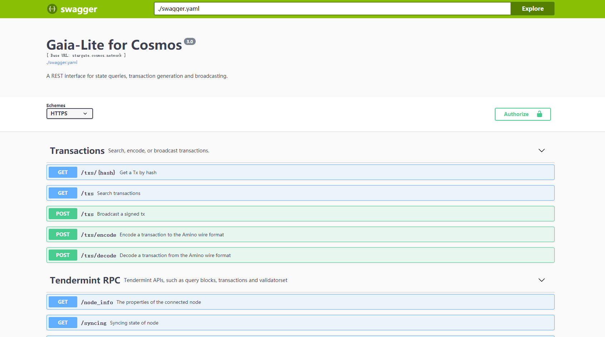
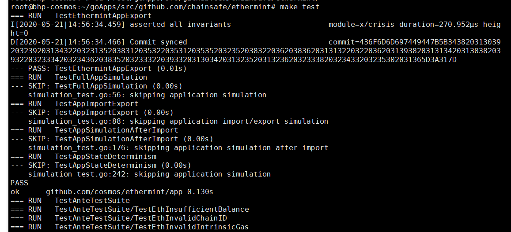

## 准备环境

首先，通过运行以下命令确保您的系统和apt包列表完全更新：

```
apt-get update -y
apt-get upgrade -y
```
安装golang
```
curl -O https://dl.google.com/go/go1.14.3.linux-amd64.tar.gz
tar -xvf go1.14.3.linux-amd64.tar.gz
mv go /usr/local
echo "export PATH=\$PATH:/usr/local/go/bin" >> ~/.profile

mkdir goApps
echo "export GOPATH=/root/goApps" >> ~/.profile
echo "export PATH=\$PATH:\$GOPATH/bin" >> ~/.profile
source ~/.profile
```
设置go代理
```
export GOPROXY=https://goproxy.io
```
安装make
```
apt install make
```
安装git
```
apt install git
```
检验git是否安装成功
```
git version
```
## 使用指南
### 下载源码
下载源码，可选择github或者码云gitee下载。

github：

```
https://github.com/chainsafe/ethermint
git clone https://github.com/chainsafe/ethermint.git
```
gitee：
```
https://gitee.com/holechain/ethermint/
git clone https://gitee.com/holechain/ethermint.git
```
查看项目代码是否是在`development`分支。
```
git branch
```
如果不是切换到`development`分支。
```
git checkout development
```
 ### 构建Ethermint
在 `ethermint`目录下安装
>请确保您的服务器可以访问 google.com，因为我们的项目依赖于google提供的某些库（如果您无法访问google.com，也可以尝试添加代理：export GOPROXY=https://goproxy.io）
```
make install
```
构建二进制文件并将其放到 ./build 目录下
```
make build
```
####  启动Ethermint节点
启动节点可分为自动初始化和手动初始化
- 自动初始化

有两种方式，前台运行和后台运行程序，建议使用后者。运行程序默认使用端口为26657。

1. 进入`ethermint`目录，执行启动脚本（前台运行）
```
./init.sh
```
2. 后台运行并指定日志文件为init.log
```
nohup ./init.sh > init.log &
```
- 手动初始化

首先创建用于签署创始交易的密钥：(代码中的mykey替换成自己定义的字段,比如换成：bhptest2)
```
emintd init mymoniker --chain-id 8
emintcli config chain-id 8
emintcli config output json
emintcli config indent true
emintcli config trust-node true

emintcli config keyring-backend test

emintcli keys add bhptest2
emintd add-genesis-account $(emintcli keys show bhptest2 -a) 1000000000000000000photon,1000000000000000000stake
emintd gentx --name bhptest2 --keyring-backend test

# Collect genesis tx
emintd collect-gentxs

emintd validate-genesis

emintd start --pruning=nothing
```

#### 启动Ethermint Web3 RPC API

重新打开一个终端，指定web3 rpc接口的ip和端口。

1. 开启另一个终端执行（可选择前台运行和后台运行）
```
emintcli rest-server --laddr "tcp://localhost:8545" --unlock-key mykey
nohup emintcli rest-server --laddr "tcp://localhost:8545" --unlock-key mykey > server.log &
```
2. 如果想要外网访问可执行（可选择前台运行和后台运行）
```
emintcli rest-server --laddr "tcp://0.0.0.0:8545" --unlock-key mykey
```
```
nohup emintcli rest-server --laddr "tcp://0.0.0.0:8545" --unlock-key mykey > server.log &
tail -f server.log
```
3. 可以通过以下命令测试RPC接口是否正常（另一个终端执行）
```
curl -X POST --data '{"jsonrpc":"2.0","method":"eth_blockNumber","params":[],"id":1}' -H "Content-Type: application/json" http://ip:8545
```
4. 访问ip:8545可以看到对应swagger-ui.html
 

#### 重置区块数据

emintd 和emintcli运行之后的数据默认存储在`/.emintd` 和 `/.emintcli`，如果打算重置数据，执行下方代码

```
rm -rf ~/.emint*
```

 

#### 导出ETH私钥

1. 导出私钥

```
emintcli keys unsafe-export-eth-key mykey
```
2. 通过账户导入私钥并且校验以太坊地址是否正确
```
emintcli keys parse $(emintcli keys show mykey -a)
```
返回结果
```
{
 "human": "cosmos",
 "bytes": "40922CB497DAB308DFF3DBF1BA4C9857D444C747"
}
```

#### 测试

1. 接口测试
```
make test
```
 

2. 客户端工具测试（暂无）
```
make test-cli
```
### 节点集群

[Ethermint部署多节点](./node-cluster-of-ethermint.md)

