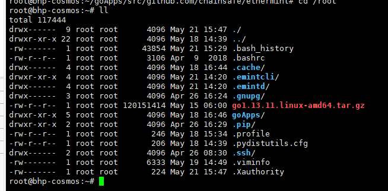

## 使用指南
### 下载源码
安装git
首先，通过运行以下命令确保您的系统和apt包列表完全更新：

```
apt-get update -y
apt-get upgrade -y
```
然后安装git
```
apt install git
```
下载源码，可选择github或者码云gitee下载。

github：

```
https://github.com/chainsafe/ethermint
下载源码，可选择国内镜像源码云gitee下载。
```
gitee：
```
https://gitee.com/nrgh/ethermint/
git clone https://gitee.com/nrgh/ethermint.git
```
 ### 构建ethermint

设置go代理
```
export GOPROXY=https://goproxy.io
```
构建项目并在 $GOBIN （golang的环境变量）目录下安装
```
make install
```
构建二进制文件并将其放到 ./build 目录下
```
make build
```
####  启动ethermint节点

- 自动初始化

有两种方式，前台运行和后台运行程序，建议使用后者。运行程序默认使用端口为26657。

a、进入ethermint根目录，执行启动脚本（前台运行）
```
./init.sh
```
b、后台运行并指定日志文件为init.log
```
nohup ./init.sh > init.log &
```
- 手动初始化

#### 启动Ethermint Web3 RPC API

重新打开一个终端，指定web3 rpc接口的ip和端口。

a、开启另一个终端执行（可选择前台运行和后台运行）
```
emintcli rest-server --laddr "tcp://localhost:8545" --unlock-key mykey
nohup emintcli rest-server --laddr "tcp://localhost:8545" --unlock-key mykey > server.log &
```
b、如果想要外网访问可执行（可选择前台运行和后台运行）
```
emintcli rest-server --laddr "tcp://0.0.0.0:8545" --unlock-key mykey
```
```
nohup emintcli rest-server --laddr "tcp://0.0.0.0:8545" --unlock-key mykey > server.log &
tail -f server.log
```
c、可以通过以下命令测试RPC接口是否正常（另一个终端执行）
```
curl -X POST --data '{"jsonrpc":"2.0","method":"eth_blockNumber","params":[],"id":1}' -H "Content-Type: application/json" http://ip:8545
```
d、访问ip:8545可以看到对应swagger-ui.html
 

#### 重置区块数据

emintd 和emintcli运行之后的数据默认存储在/.emintd 和 /.emintcli，如果打算重置数据，执行下方代码

```
rm -rf ~/.emint*
```

 

#### 导出ETH私钥

a、导出私钥

```
emintcli keys unsafe-export-eth-key mykey
```
b、通过账户导入私钥并且校验以太坊地址是否正确
```
emintcli keys parse $(emintcli keys show mykey -a)
```
返回结果
```
{
 "human": "cosmos",
 "bytes": "40922CB497DAB308DFF3DBF1BA4C9857D444C747"
}
```

#### 测试

a、接口测试
```
make test
```
 

b、客户端工具测试（暂无）
```
make test-cli
```