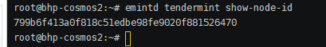

## Ethermint节点集群
Ethermint可选用手动初始化搭建多节点

删除现有的守护程序`.emintd`和客户端`.emintcli`
```
rm -rf ~/.emint*
```
设置Ethermint的网络别名和chain-id(生成`.emintd`目录，初始化配置文件`config`和数据`data`)
```
emintd init node0 --chain-id 8
```
参数设置
```
emintcli config chain-id 8
emintcli config output json
emintcli config indent true
emintcli config trust-node true
emintcli config keyring-backend test
```
签署创始交易的密钥：(代码中的mykey替换成自己定义的字段,比如换成：bhptest2)
```
emintcli keys add bhptest2
```
分配创始帐户额度
```
emintd add-genesis-account $(emintcli keys show bhptest2 -a) 1000000000000000000photon,1000000000000000000stake
emintd gentx --name bhptest2 --keyring-backend test
```
查看创始交易集合
```
emintd collect-gentxs
```
验证有效性
```
emintd validate-genesis
```
获取本节点node-id
```
emintd tendermint show-node-id
```
 

多节点启动
```
emintd start --p2p.persistent_peers="f5088aa26cf82be7657977603d5a8f9f9cfae267@127.0.0.1:26606,ddb4df78fe5bdf120e8ba9468857765756948e18@127.0.0.1:26616,6bb7f6e1ef06ab114708e421ec84352f5f203e21@127.0.0.1:26626,13db9b7388f2192bd65ded3cdf1216ad7e17e6db@127.0.0.1:26636"
```

单节点启动（如果不需要历史查询可移除`--pruning=nothing`）
```
emintd start --pruning=nothing --rpc.unsafe --log_level "main:info,state:info,mempool:info" --trace
```
复制
```shell script
cp -r /root/.emintd /home/testnode/000/
cp -r /root/.emintcli /home/testnode/000/
```

第一个节点
```
rm -rf ~/.emint*
./emintd init node0 --chain-id 8
./emintcli config chain-id 8
./emintcli config output json
./emintcli config indent true
./emintcli config trust-node true
./emintcli config keyring-backend test
./emintcli keys add bhptest0

./emintd add-genesis-account $(emintcli keys show bhptest0 -a) 1000000000000000000photon,1000000000000000000stake
./emintd gentx --name bhptest0 --keyring-backend test
./emintd collect-gentxs
./emintd validate-genesis
./emintd tendermint show-node-id

```
第二个节点
```
rm -rf ~/.emint*
./emintd init node1 --chain-id 8
./emintcli config chain-id 8
./emintcli config output json
./emintcli config indent true
./emintcli config trust-node true
./emintcli config keyring-backend test
./emintcli keys add bhptest1

./emintd add-genesis-account $(emintcli keys show bhptest1 -a) 1000000000000000000photon,1000000000000000000stake
./emintd gentx --name bhptest1 --keyring-backend test
./emintd collect-gentxs
./emintd validate-genesis
./emintd tendermint show-node-id
```
第三个节点
```
rm -rf ~/.emint*
./emintd init node2 --chain-id 8
./emintcli config chain-id 8
./emintcli config output json
./emintcli config indent true
./emintcli config trust-node true
./emintcli config keyring-backend test
./emintcli keys add bhptest2

./emintd add-genesis-account $(emintcli keys show bhptest2 -a) 1000000000000000000photon,1000000000000000000stake
./emintd gentx --name bhptest2 --keyring-backend test
./emintd collect-gentxs
./emintd validate-genesis
./emintd tendermint show-node-id
```
第四个节点
```
rm -rf ~/.emint*
./emintd init node3 --chain-id 8
./emintcli config chain-id 8
./emintcli config output json
./emintcli config indent true
./emintcli config trust-node true
./emintcli config keyring-backend test
./emintcli keys add bhptest3

./emintd add-genesis-account $(emintcli keys show bhptest3 -a) 1000000000000000000photon,1000000000000000000stake
./emintd gentx --name bhptest3 --keyring-backend test
./emintd collect-gentxs
./emintd validate-genesis
./emintd tendermint show-node-id
./emintd start --p2p.persistent_peers="44e830930073a2c2c680042a9ad15bdb552a9a56@127.0.0.1:26606,f112282214a011a9d68514e26c19a7b8a19d85b9@127.0.0.1:26616,8d503fc4bd653d4eb333cc7f3fbc6d1533e82190@127.0.0.1:26626,77ba7f0ded705826b02d67406d394066f1a2dd41@127.0.0.1:26636"
```