Tenermint节点搭建按照系统可分为windows和linux方式。
##Windows方式搭建
###工具和环境
- Windows10系统
- GIt Bash
###搭建说明
本次搭建基于测试环境，在一台电脑上直接进行多个节点搭建；正式环境请使用多台服务器组合搭建。
###搭建步骤
1. 进入发行版页面下载最新win版执行文件
[https://github.com/tendermint/tendermint/releases](https://github.com/tendermint/tendermint/releases)

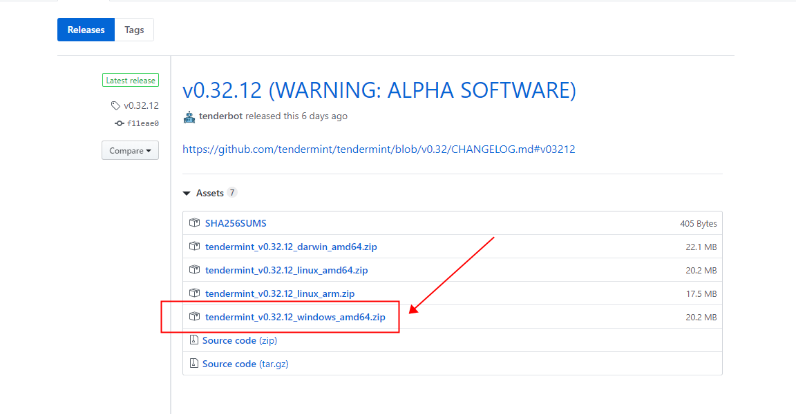
2. 本地新建四个文件夹，分别命名为0 1 2 3，把刚下载好的tendermint文件放入到目录0中。

3. 在`目录0`文件夹中右键打开git bash，然后输入以下命令生成四个节点配置文件。
```
./tendermint testnet
```
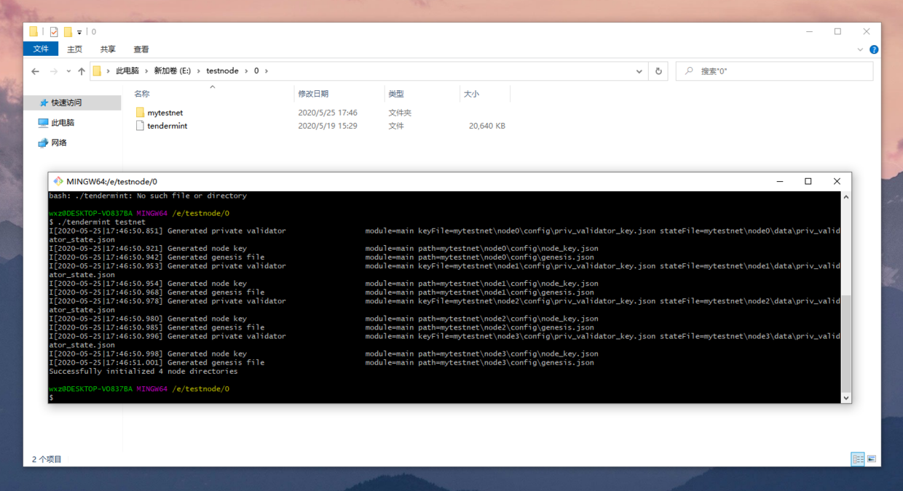
日志为：
```
I[2020-05-25|17:46:50.851] Generated private validator                  module=main keyFile=mytestnet\node0\config\priv_validator_key.json stateFile=mytestnet\node0\data\priv_validator_state.json
I[2020-05-25|17:46:50.921] Generated node key                           module=main path=mytestnet\node0\config\node_key.json
I[2020-05-25|17:46:50.942] Generated genesis file                       module=main path=mytestnet\node0\config\genesis.json
I[2020-05-25|17:46:50.953] Generated private validator                  module=main keyFile=mytestnet\node1\config\priv_validator_key.json stateFile=mytestnet\node1\data\priv_validator_state.json
I[2020-05-25|17:46:50.954] Generated node key                           module=main path=mytestnet\node1\config\node_key.json
I[2020-05-25|17:46:50.968] Generated genesis file                       module=main path=mytestnet\node1\config\genesis.json
I[2020-05-25|17:46:50.978] Generated private validator                  module=main keyFile=mytestnet\node2\config\priv_validator_key.json stateFile=mytestnet\node2\data\priv_validator_state.json
I[2020-05-25|17:46:50.980] Generated node key                           module=main path=mytestnet\node2\config\node_key.json
I[2020-05-25|17:46:50.985] Generated genesis file                       module=main path=mytestnet\node2\config\genesis.json
I[2020-05-25|17:46:50.996] Generated private validator                  module=main keyFile=mytestnet\node3\config\priv_validator_key.json stateFile=mytestnet\node3\data\priv_validator_state.json
I[2020-05-25|17:46:50.998] Generated node key                           module=main path=mytestnet\node3\config\node_key.json
I[2020-05-25|17:46:51.001] Generated genesis file                       module=main path=mytestnet\node3\config\genesis.json
Successfully initialized 4 node directories
```
系统会自动生成mytestnet文件夹，包含node0、node1、node2、node3四个二级文件夹。
4、进入`node0`目录下的`config`目录，编辑`config.toml`文件

将文件中的端口2665X改为2660X，如下
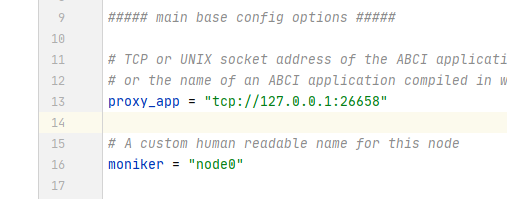
将文中的以下代码
```
proxy_app = "tcp://127.0.0.1:26658"
laddr = "tcp://127.0.0.1:26607"
laddr = "tcp://0.0.0.0:26606"
persistent_peers = "6e246ba5675a5036cc13a8e486693b5775d98fe8@node0:26656,adfcd468f111404b09cea838eb574e6bc52fc55f@node1:26656,0f059958939f99f813a2ebefcb5ff2d7a0798575@node2:26656,a822ecd614b8e225b8ca2404586f2bd9386711e7@node3:26656"
```
改为
```
proxy_app = "tcp://127.0.0.1:26608"
laddr = "tcp://127.0.0.1:26607"
laddr = "tcp://0.0.0.0:26606"
persistent_peers = "6e246ba5675a5036cc13a8e486693b5775d98fe8@node0:26606,adfcd468f111404b09cea838eb574e6bc52fc55f@node1:26616,0f059958939f99f813a2ebefcb5ff2d7a0798575@node2:26626,a822ecd614b8e225b8ca2404586f2bd9386711e7@node3:26636"
```
此时，node0目录已经改好，node1目录同理将2665X端口改为2661X，与修改node0的config.toml文件的方法相似，修改部分之后如下方代码所示。
```
proxy_app = "tcp://127.0.0.1:26618"
laddr = "tcp://127.0.0.1:26617"
laddr = "tcp://0.0.0.0:26616"
persistent_peers = "6e246ba5675a5036cc13a8e486693b5775d98fe8@node0:26606,adfcd468f111404b09cea838eb574e6bc52fc55f@node1:26616,0f059958939f99f813a2ebefcb5ff2d7a0798575@node2:26626,a822ecd614b8e225b8ca2404586f2bd9386711e7@node3:26636"
```
node2和node3同理，自行改之，不做过多介绍。
5. 将改好之后的mytestnet连同tendermint分别复制到其他1、2、3目录下，如下图所示
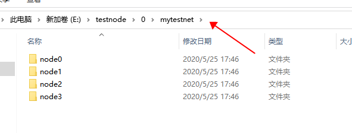
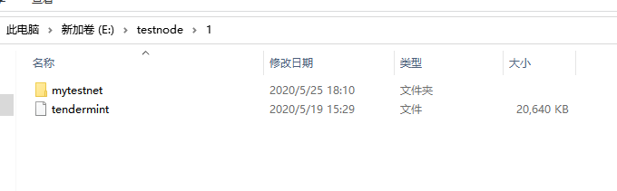

6. 在目录0中执行以下代码，获取四个节点ID。
```
./tendermint show_node_id --home ./mytestnet/node0
./tendermint show_node_id --home ./mytestnet/node1
./tendermint show_node_id --home ./mytestnet/node2
./tendermint show_node_id --home ./mytestnet/node3
```
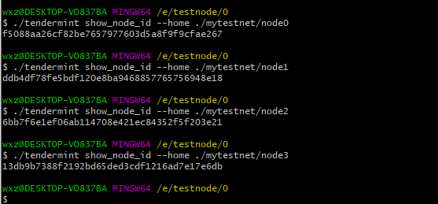
日志：
```
wxz@DESKTOP-VO837BA MINGW64 /e/testnode/0
$ ./tendermint show_node_id --home ./mytestnet/node0
f5088aa26cf82be7657977603d5a8f9f9cfae267

wxz@DESKTOP-VO837BA MINGW64 /e/testnode/0
$ ./tendermint show_node_id --home ./mytestnet/node1
ddb4df78fe5bdf120e8ba9468857765756948e18

wxz@DESKTOP-VO837BA MINGW64 /e/testnode/0
$ ./tendermint show_node_id --home ./mytestnet/node2
6bb7f6e1ef06ab114708e421ec84352f5f203e21

wxz@DESKTOP-VO837BA MINGW64 /e/testnode/0
$ ./tendermint show_node_id --home ./mytestnet/node3
13db9b7388f2192bd65ded3cdf1216ad7e17e6db
```
7. 将获取到的四个节点拼接
拼接之前：
```
tendermint node --home ./mytestnet/node0 --proxy_app=kvstore --p2p.persistent_peers="ID1@IP1:26656,ID2@IP2:26656,ID3@IP3:26656,ID4@IP4:26656"
tendermint node --home ./mytestnet/node1 --proxy_app=kvstore --p2p.persistent_peers="ID1@IP1:26656,ID2@IP2:26656,ID3@IP3:26656,ID4@IP4:26656"
tendermint node --home ./mytestnet/node2 --proxy_app=kvstore --p2p.persistent_peers="ID1@IP1:26656,ID2@IP2:26656,ID3@IP3:26656,ID4@IP4:26656"
tendermint node --home ./mytestnet/node3 --proxy_app=kvstore --p2p.persistent_peers="ID1@IP1:26656,ID2@IP2:26656,ID3@IP3:26656,ID4@IP4:26656"
```
拼接之后：（在每个目录执行对应代码，目录0指定node0、目录1指定node1....）
```
./tendermint node --home ./mytestnet/node0 --proxy_app=kvstore --p2p.persistent_peers="f5088aa26cf82be7657977603d5a8f9f9cfae267@127.0.0.1:26606,ddb4df78fe5bdf120e8ba9468857765756948e18@127.0.0.1:26616,6bb7f6e1ef06ab114708e421ec84352f5f203e21@127.0.0.1:26626,13db9b7388f2192bd65ded3cdf1216ad7e17e6db@127.0.0.1:26636"

./tendermint node --home ./mytestnet/node1 --proxy_app=kvstore --p2p.persistent_peers="f5088aa26cf82be7657977603d5a8f9f9cfae267@127.0.0.1:26606,ddb4df78fe5bdf120e8ba9468857765756948e18@127.0.0.1:26616,6bb7f6e1ef06ab114708e421ec84352f5f203e21@127.0.0.1:26626,13db9b7388f2192bd65ded3cdf1216ad7e17e6db@127.0.0.1:26636"

./tendermint node --home ./mytestnet/node2 --proxy_app=kvstore --p2p.persistent_peers="f5088aa26cf82be7657977603d5a8f9f9cfae267@127.0.0.1:26606,ddb4df78fe5bdf120e8ba9468857765756948e18@127.0.0.1:26616,6bb7f6e1ef06ab114708e421ec84352f5f203e21@127.0.0.1:26626,13db9b7388f2192bd65ded3cdf1216ad7e17e6db@127.0.0.1:26636"

./tendermint node --home ./mytestnet/node3 --proxy_app=kvstore --p2p.persistent_peers="f5088aa26cf82be7657977603d5a8f9f9cfae267@127.0.0.1:26606,ddb4df78fe5bdf120e8ba9468857765756948e18@127.0.0.1:26616,6bb7f6e1ef06ab114708e421ec84352f5f203e21@127.0.0.1:26626,13db9b7388f2192bd65ded3cdf1216ad7e17e6db@127.0.0.1:26636"
```
8. 四个节点搭建成功，成功截图如下方动图所示

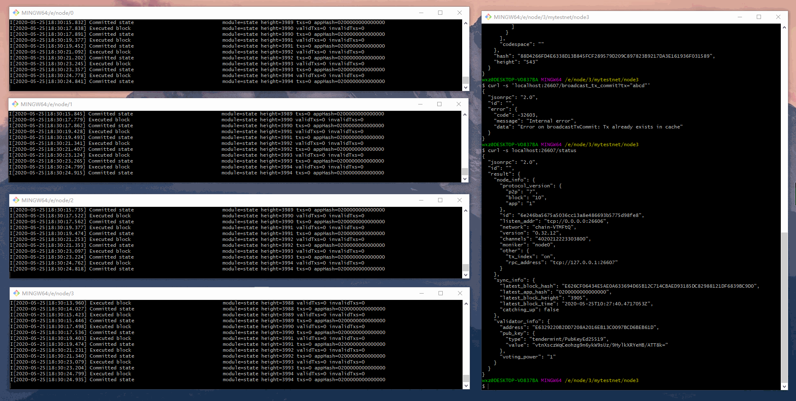
###Linux方式搭建
1. 在home目录新建`testnode`文件夹
```
mkdir testnode
```
2. 在testnode目录下新建四个文件夹，分别为000、001、002、003文件夹。
···
mkdir 000
mkdir 001
mkdir 002
mkdir 003
···
3.  进入`000`目录下，执行以下命令生成四个节点配置文件
```
./tendermint testnet
```
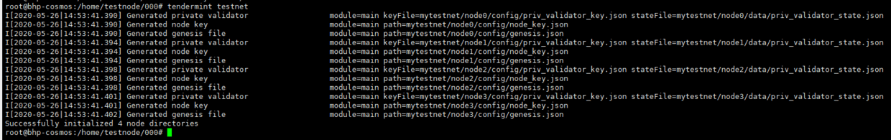
4. 进入`000`目录=>`mytestnet`目录=>`node0`目录=>`config`目录
```
cd mytestnet/node0/config
```
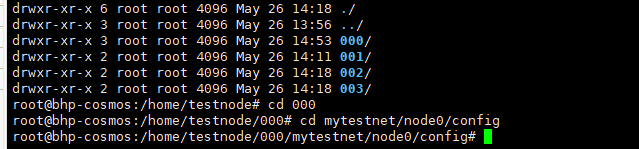
5. 编辑conf.toml文件，修改p2p端口号和rpc端口号

修改后，如下方代码所示
```
# This is a TOML config file.
# For more information, see https://github.com/toml-lang/toml

# NOTE: Any path below can be absolute (e.g. "/var/myawesomeapp/data") or
# relative to the home directory (e.g. "data"). The home directory is
# "$HOME/.tendermint" by default, but could be changed via $TMHOME env variable
# or --home cmd flag.

##### main base config options #####

# TCP or UNIX socket address of the ABCI application,
# or the name of an ABCI application compiled in with the Tendermint binary
proxy_app = "tcp://127.0.0.1:26618"

# A custom human readable name for this node
moniker = "node1"

# If this node is many blocks behind the tip of the chain, FastSync
# allows them to catchup quickly by downloading blocks in parallel
# and verifying their commits
fast_sync = true

# Database backend: goleveldb | cleveldb | boltdb | rocksdb
# * goleveldb (github.com/syndtr/goleveldb - most popular implementation)
#   - pure go
#   - stable
# * cleveldb (uses levigo wrapper)
#   - fast
#   - requires gcc
#   - use cleveldb build tag (go build -tags cleveldb)
# * boltdb (uses etcd's fork of bolt - github.com/etcd-io/bbolt)
#   - EXPERIMENTAL
#   - may be faster is some use-cases (random reads - indexer)
#   - use boltdb build tag (go build -tags boltdb)
# * rocksdb (uses github.com/tecbot/gorocksdb)
#   - EXPERIMENTAL
#   - requires gcc
#   - use rocksdb build tag (go build -tags rocksdb)
db_backend = "goleveldb"

# Database directory
db_dir = "data"

# Output level for logging, including package level options
log_level = "main:info,state:info,statesync:info,*:error"

# Output format: 'plain' (colored text) or 'json'
log_format = "plain"

##### additional base config options #####

# Path to the JSON file containing the initial validator set and other meta data
genesis_file = "config/genesis.json"

# Path to the JSON file containing the private key to use as a validator in the consensus protocol
priv_validator_key_file = "config/priv_validator_key.json"

# Path to the JSON file containing the last sign state of a validator
priv_validator_state_file = "data/priv_validator_state.json"

# TCP or UNIX socket address for Tendermint to listen on for
# connections from an external PrivValidator process
priv_validator_laddr = ""

# Path to the JSON file containing the private key to use for node authentication in the p2p protocol
node_key_file = "config/node_key.json"

# Mechanism to connect to the ABCI application: socket | grpc
abci = "socket"

# TCP or UNIX socket address for the profiling server to listen on
prof_laddr = ""

# If true, query the ABCI app on connecting to a new peer
# so the app can decide if we should keep the connection or not
filter_peers = false

##### advanced configuration options #####

##### rpc server configuration options #####
[rpc]

# TCP or UNIX socket address for the RPC server to listen on
laddr = "tcp://127.0.0.1:26617"

# A list of origins a cross-domain request can be executed from
# Default value '[]' disables cors support
# Use '["*"]' to allow any origin
cors_allowed_origins = []

# A list of methods the client is allowed to use with cross-domain requests
cors_allowed_methods = ["HEAD", "GET", "POST", ]

# A list of non simple headers the client is allowed to use with cross-domain requests
cors_allowed_headers = ["Origin", "Accept", "Content-Type", "X-Requested-With", "X-Server-Time", ]

# TCP or UNIX socket address for the gRPC server to listen on
# NOTE: This server only supports /broadcast_tx_commit
grpc_laddr = ""

# Maximum number of simultaneous connections.
# Does not include RPC (HTTP&WebSocket) connections. See max_open_connections
# If you want to accept a larger number than the default, make sure
# you increase your OS limits.
# 0 - unlimited.
# Should be < {ulimit -Sn} - {MaxNumInboundPeers} - {MaxNumOutboundPeers} - {N of wal, db and other open files}
# 1024 - 40 - 10 - 50 = 924 = ~900
grpc_max_open_connections = 900

# Activate unsafe RPC commands like /dial_seeds and /unsafe_flush_mempool
unsafe = false

# Maximum number of simultaneous connections (including WebSocket).
# Does not include gRPC connections. See grpc_max_open_connections
# If you want to accept a larger number than the default, make sure
# you increase your OS limits.
# 0 - unlimited.
# Should be < {ulimit -Sn} - {MaxNumInboundPeers} - {MaxNumOutboundPeers} - {N of wal, db and other open files}
# 1024 - 40 - 10 - 50 = 924 = ~900
max_open_connections = 900

# Maximum number of unique clientIDs that can /subscribe
# If you're using /broadcast_tx_commit, set to the estimated maximum number
# of broadcast_tx_commit calls per block.
max_subscription_clients = 100

# Maximum number of unique queries a given client can /subscribe to
# If you're using GRPC (or Local RPC client) and /broadcast_tx_commit, set to
# the estimated # maximum number of broadcast_tx_commit calls per block.
max_subscriptions_per_client = 5

# How long to wait for a tx to be committed during /broadcast_tx_commit.
# WARNING: Using a value larger than 10s will result in increasing the
# global HTTP write timeout, which applies to all connections and endpoints.
# See https://github.com/tendermint/tendermint/issues/3435
timeout_broadcast_tx_commit = "10s"

# Maximum size of request body, in bytes
max_body_bytes = 1000000

# Maximum size of request header, in bytes
max_header_bytes = 1048576

# The path to a file containing certificate that is used to create the HTTPS server.
# Migth be either absolute path or path related to tendermint's config directory.
# If the certificate is signed by a certificate authority,
# the certFile should be the concatenation of the server's certificate, any intermediates,
# and the CA's certificate.
# NOTE: both tls_cert_file and tls_key_file must be present for Tendermint to create HTTPS server.
# Otherwise, HTTP server is run.
tls_cert_file = ""

# The path to a file containing matching private key that is used to create the HTTPS server.
# Migth be either absolute path or path related to tendermint's config directory.
# NOTE: both tls_cert_file and tls_key_file must be present for Tendermint to create HTTPS server.
# Otherwise, HTTP server is run.
tls_key_file = ""

##### peer to peer configuration options #####
[p2p]

# Address to listen for incoming connections
laddr = "tcp://0.0.0.0:26616"

# Address to advertise to peers for them to dial
# If empty, will use the same port as the laddr,
# and will introspect on the listener or use UPnP
# to figure out the address.
external_address = ""

# Comma separated list of seed nodes to connect to
seeds = ""

# Comma separated list of nodes to keep persistent connections to
persistent_peers = "9f6594ced1cd8314c359b34bded2ac9880b60340@node0:26606,382f5658c2e47db72b2556d4ffb2cba22160dffc@node1:26616,b8316e5743c1ec7e0595b65cefec7a7c5748158b@node2:26626,b92e1328d91ab40e2de9bd7f5a1df58741aa0204@node3:26636"

# UPNP port forwarding
upnp = false

# Path to address book
addr_book_file = "config/addrbook.json"

# Set true for strict address routability rules
# Set false for private or local networks
addr_book_strict = false

# Maximum number of inbound peers
max_num_inbound_peers = 40

# Maximum number of outbound peers to connect to, excluding persistent peers
max_num_outbound_peers = 10

# List of node IDs, to which a connection will be (re)established ignoring any existing limits
unconditional_peer_ids = ""

# Maximum pause when redialing a persistent peer (if zero, exponential backoff is used)
persistent_peers_max_dial_period = "0s"

# Time to wait before flushing messages out on the connection
flush_throttle_timeout = "100ms"

# Maximum size of a message packet payload, in bytes
max_packet_msg_payload_size = 1024

# Rate at which packets can be sent, in bytes/second
send_rate = 5120000

# Rate at which packets can be received, in bytes/second
recv_rate = 5120000

# Set true to enable the peer-exchange reactor
pex = true

# Seed mode, in which node constantly crawls the network and looks for
# peers. If another node asks it for addresses, it responds and disconnects.
#
# Does not work if the peer-exchange reactor is disabled.
seed_mode = false

# Comma separated list of peer IDs to keep private (will not be gossiped to other peers)
private_peer_ids = ""

# Toggle to disable guard against peers connecting from the same ip.
allow_duplicate_ip = true

# Peer connection configuration.
handshake_timeout = "20s"
dial_timeout = "3s"

##### mempool configuration options #####
[mempool]

recheck = true
broadcast = true
wal_dir = ""

# Maximum number of transactions in the mempool
size = 5000

# Limit the total size of all txs in the mempool.
# This only accounts for raw transactions (e.g. given 1MB transactions and
# max_txs_bytes=5MB, mempool will only accept 5 transactions).
max_txs_bytes = 1073741824

# Size of the cache (used to filter transactions we saw earlier) in transactions
cache_size = 10000

# Maximum size of a single transaction.
# NOTE: the max size of a tx transmitted over the network is {max_tx_bytes} + {amino overhead}.
max_tx_bytes = 1048576

##### state sync configuration options #####
[statesync]
# State sync rapidly bootstraps a new node by discovering, fetching, and restoring a state machine
# snapshot from peers instead of fetching and replaying historical blocks. Requires some peers in
# the network to take and serve state machine snapshots. State sync is not attempted if the node
# has any local state (LastBlockHeight > 0). The node will have a truncated block history,
# starting from the height of the snapshot.
enable = false

# RPC servers (comma-separated) for light client verification of the synced state machine and
# retrieval of state data for node bootstrapping. Also needs a trusted height and corresponding
# header hash obtained from a trusted source, and a period during which validators can be trusted.
#
# For Cosmos SDK-based chains, trust_period should usually be about 2/3 of the unbonding time (~2
# weeks) during which they can be financially punished (slashed) for misbehavior.
rpc_servers = ""
trust_height = 0
trust_hash = ""
trust_period = "0s"

# Temporary directory for state sync snapshot chunks, defaults to the OS tempdir (typically /tmp).
# Will create a new, randomly named directory within, and remove it when done.
temp_dir = ""

##### fast sync configuration options #####
[fastsync]

# Fast Sync version to use:
#   1) "v0" (default) - the legacy fast sync implementation
#   2) "v1" - refactor of v0 version for better testability
#   3) "v2" - refactor of v1 version for better usability
version = "v0"

##### consensus configuration options #####
[consensus]

wal_file = "data/cs.wal/wal"

timeout_propose = "3s"
timeout_propose_delta = "500ms"
timeout_prevote = "1s"
timeout_prevote_delta = "500ms"
timeout_precommit = "1s"
timeout_precommit_delta = "500ms"
timeout_commit = "1s"

# Make progress as soon as we have all the precommits (as if TimeoutCommit = 0)
skip_timeout_commit = false

# EmptyBlocks mode and possible interval between empty blocks
create_empty_blocks = true
create_empty_blocks_interval = "0s"

# Reactor sleep duration parameters
peer_gossip_sleep_duration = "100ms"
peer_query_maj23_sleep_duration = "2s"

##### transactions indexer configuration options #####
[tx_index]

# What indexer to use for transactions
#
# Options:
#   1) "null"
#   2) "kv" (default) - the simplest possible indexer, backed by key-value storage (defaults to levelDB; see DBBackend).
indexer = "kv"

# Comma-separated list of compositeKeys to index (by default the only key is "tx.hash")
# Remember that Event has the following structure: type.key
# type: [
#  key: value,
#  ...
# ]
#
# You can also index transactions by height by adding "tx.height" key here.
#
# It's recommended to index only a subset of keys due to possible memory
# bloat. This is, of course, depends on the indexer's DB and the volume of
# transactions.
index_keys = ""

# When set to true, tells indexer to index all compositeKeys (predefined keys:
# "tx.hash", "tx.height" and all keys from DeliverTx responses).
#
# Note this may be not desirable (see the comment above). IndexKeys has a
# precedence over IndexAllKeys (i.e. when given both, IndexKeys will be
# indexed).
index_all_keys = false

##### instrumentation configuration options #####
[instrumentation]

# When true, Prometheus metrics are served under /metrics on
# PrometheusListenAddr.
# Check out the documentation for the list of available metrics.
prometheus = false

# Address to listen for Prometheus collector(s) connections
prometheus_listen_addr = ":26660"

# Maximum number of simultaneous connections.
# If you want to accept a larger number than the default, make sure
# you increase your OS limits.
# 0 - unlimited.
max_open_connections = 3

# Instrumentation namespace
namespace = "tendermint"
```
依次修改001、002、003下的config.toml文件。
6.  在目录000中执行以下代码，获取四个节点ID。
```
tendermint show_node_id --home ./mytestnet/node0
tendermint show_node_id --home ./mytestnet/node1
tendermint show_node_id --home ./mytestnet/node2
tendermint show_node_id --home ./mytestnet/node3
```
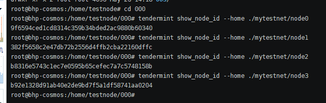
7. 将获取到的四个节点拼接
拼接之前：
```
tendermint node --home ./mytestnet/node0 --proxy_app=kvstore --p2p.persistent_peers="ID1@IP1:26656,ID2@IP2:26656,ID3@IP3:26656,ID4@IP4:26656"
tendermint node --home ./mytestnet/node1 --proxy_app=kvstore --p2p.persistent_peers="ID1@IP1:26656,ID2@IP2:26656,ID3@IP3:26656,ID4@IP4:26656"
tendermint node --home ./mytestnet/node2 --proxy_app=kvstore --p2p.persistent_peers="ID1@IP1:26656,ID2@IP2:26656,ID3@IP3:26656,ID4@IP4:26656"
tendermint node --home ./mytestnet/node3 --proxy_app=kvstore --p2p.persistent_peers="ID1@IP1:26656,ID2@IP2:26656,ID3@IP3:26656,ID4@IP4:26656"
```
拼接之后：（在每个目录执行对应代码，目录0指定node0、目录1指定node1....）
```
nohup tendermint node --home ./mytestnet/node0 --proxy_app=kvstore --p2p.persistent_peers="9f6594ced1cd8314c359b34bded2ac9880b60340@127.0.0.1:26606,382f5658c2e47db72b2556d4ffb2cba22160dffc@127.0.0.1:26616,b8316e5743c1ec7e0595b65cefec7a7c5748158b@127.0.0.1:26626,b92e1328d91ab40e2de9bd7f5a1df58741aa0204@127.0.0.1:26636" > init000.log  &
tail -f init000.log

nohup tendermint node --home ./mytestnet/node1 --proxy_app=kvstore --p2p.persistent_peers="9f6594ced1cd8314c359b34bded2ac9880b60340@127.0.0.1:26606,382f5658c2e47db72b2556d4ffb2cba22160dffc@127.0.0.1:26616,b8316e5743c1ec7e0595b65cefec7a7c5748158b@127.0.0.1:26626,b92e1328d91ab40e2de9bd7f5a1df58741aa0204@127.0.0.1:26636" > init001.log  &
tail -f init001.log

nohup tendermint node --home ./mytestnet/node2 --proxy_app=kvstore --p2p.persistent_peers="9f6594ced1cd8314c359b34bded2ac9880b60340@127.0.0.1:26606,382f5658c2e47db72b2556d4ffb2cba22160dffc@127.0.0.1:26616,b8316e5743c1ec7e0595b65cefec7a7c5748158b@127.0.0.1:26626,b92e1328d91ab40e2de9bd7f5a1df58741aa0204@127.0.0.1:26636" > init002.log  &
tail -f init002.log

nohup tendermint node --home ./mytestnet/node3 --proxy_app=kvstore --p2p.persistent_peers="9f6594ced1cd8314c359b34bded2ac9880b60340@127.0.0.1:26606,382f5658c2e47db72b2556d4ffb2cba22160dffc@127.0.0.1:26616,b8316e5743c1ec7e0595b65cefec7a7c5748158b@127.0.0.1:26626,b92e1328d91ab40e2de9bd7f5a1df58741aa0204@127.0.0.1:26636" > init003.log  &
tail -f init003.log
```
8. 四个节点搭建成功，成功截图如下方动图所示
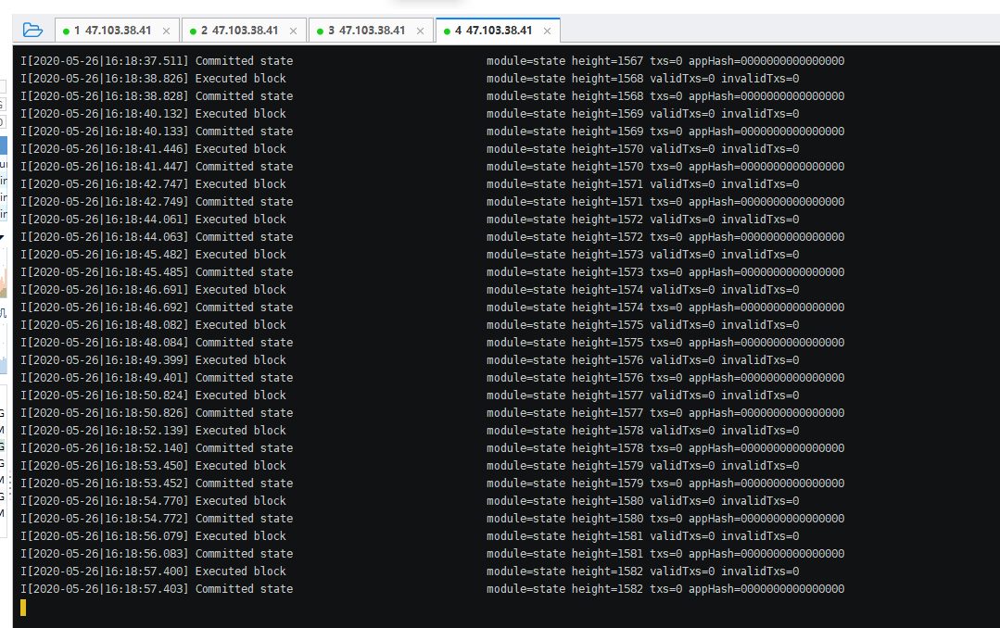


##参考文档
[https://docs.tendermint.com/master/introduction/quick-start.html](https://docs.tendermint.com/master/introduction/quick-start.html)


